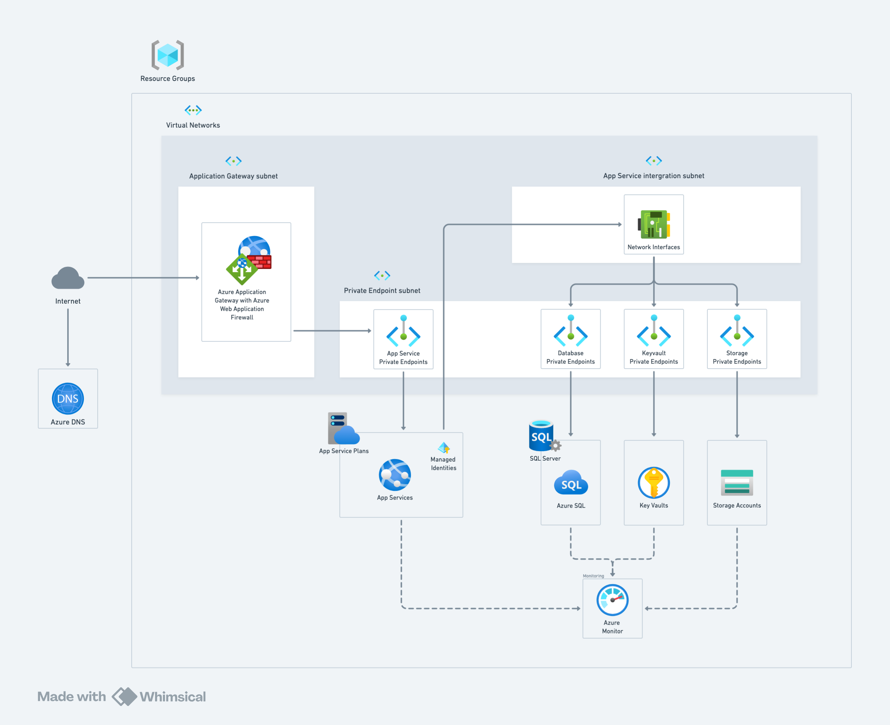
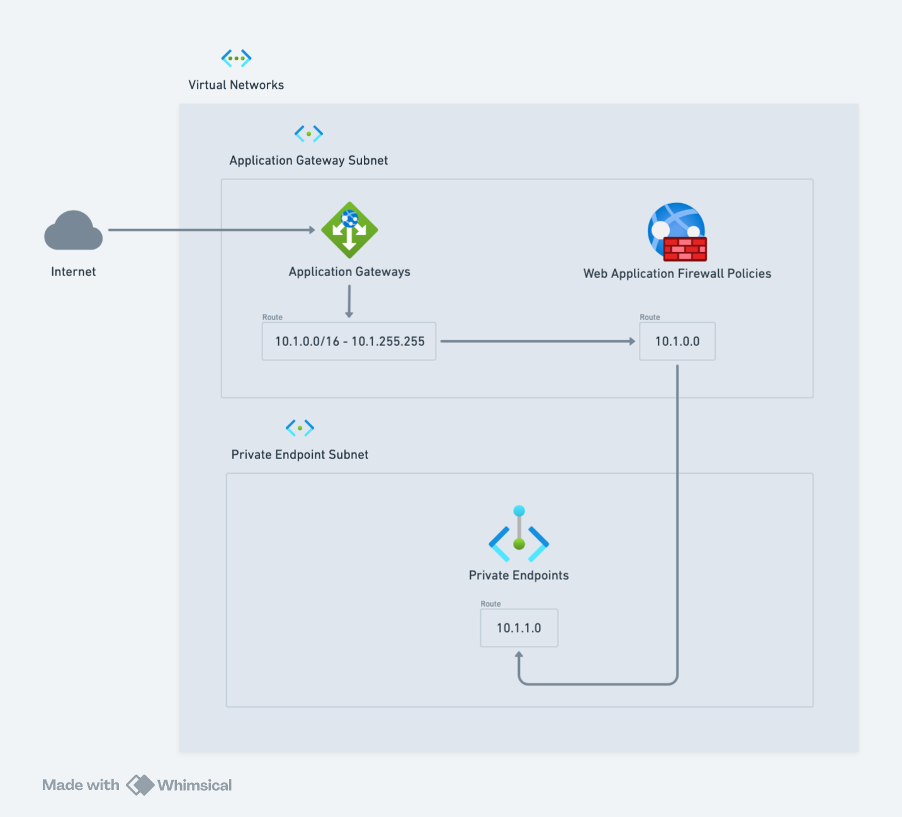
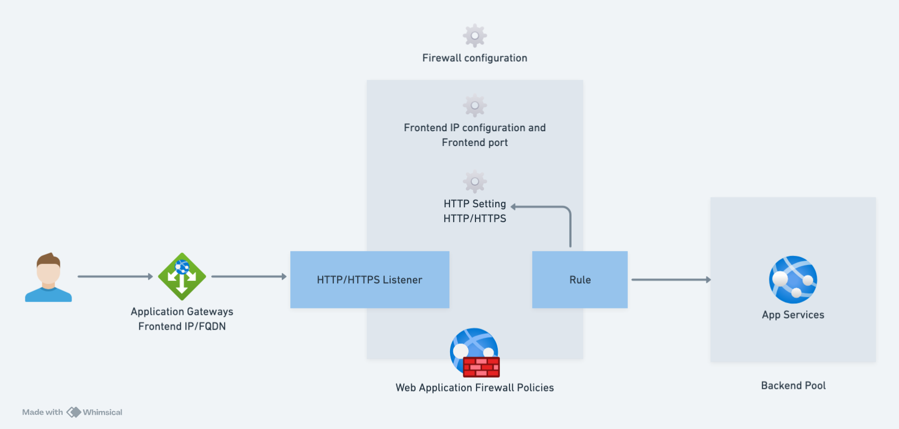
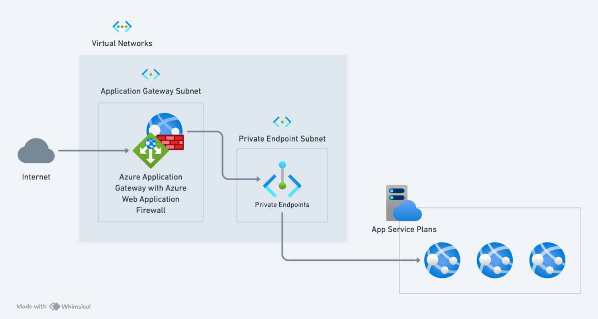
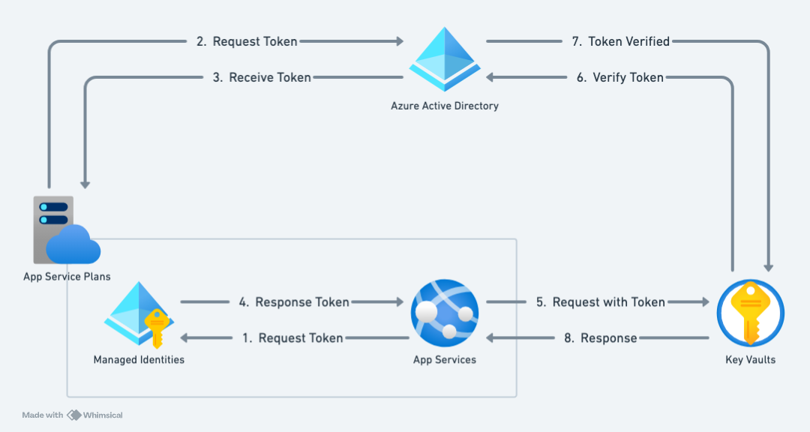

# Project Overview

This project comprises two main components: the server-side application and the infrastructure configuration using Terraform. This document outlines the architecture, how to clone the repository, run the project using Docker, and deploy the infrastructure using Terraform.

## Architecture Overview

The project uses integrated Azure services for a secure, scalable, and monitored environment.

### High-Level Architecture



- **Azure Active Directory (AAD)**: Provides identity and access management for secure access to Azure resources.
- **Azure Key Vault**: Securely stores and manages sensitive information, such as secrets used by the web app for secure operations.
- **Azure DNS**: Manages DNS domains for domain name resolution, ensuring users can access the web app using a domain name.
- **Application Gateway with Web Application Firewall (WAF)**: Manages and routes incoming web traffic, offering advanced security features to protect against threats.
- **Private Link and Private Endpoints**: Provides secure, private connectivity between Azure services and your virtual network.
- **App Service Plan**: Hosts your web applications with support for multiple deployment slots, enabling scalable and reliable web app hosting.
- **App Service**: A fully managed platform for building, deploying, and scaling web apps.
- **Logical SQL Server and SQL Database**: Manages data storage and database operations for your application.
- **Azure Monitor and Log Analytics**: Aggregates, analyzes, and visualizes metrics and logs from Azure resources, enabling effective monitoring and performance management.

### Virtual Network Architecture



Illustrates a segmented Azure virtual network with two primary subnets: the Application Gateway Subnet and the Private Endpoint Subnet.

### Gateway Architecture



Shows how the Azure Application Gateway manages and routes incoming web traffic to backend services.

### Private Link Architecture



Explains how Azure Private Link provides secure and private connectivity to Azure services.

### Managed Identities for App Service Architecture



Illustrates how Managed Identities are used to enable secure access to Azure resources without storing credentials.

### Data Flows and Interactions

- **AAD Integration**: Provides identity and access management for secure access to Azure resources.
- **Key Vault**: Securely stores and manages sensitive information, such as secrets used by the web app for secure operations.
- **DNS**: Manages DNS domains for domain name resolution, ensuring users can access the web app using a domain name.
- **Application Gateway with WAF**: Manages and routes incoming web traffic, offering advanced security features to protect against threats.
- **Private Link**: Provides secure, private connectivity between Azure services and your virtual network.
- **App Service Plan and Web App**: Hosts your web application with deployment slots, providing scalable and reliable hosting.
- **SQL Server and Database**: Manages data storage and database operations.
- **Diagnostics and Logs**: Logs and metrics are collected and sent to Log Analytics for monitoring and troubleshooting.
- **Azure Monitor**: Aggregates, analyzes, and visualizes metrics and logs from Azure resources for effective monitoring and performance management.

## Technical Setup

### Clone the Repository

To get started, follow these steps:

1. **Clone the Repository:**

   ```bash
   git clone <repository-url>
   cd <repository-directory>
   ```

2. **Set Up Environment Variables:**

   Create a `.env` file in the root directory and define the following variables:

   ```env
   WEB_PORT=8080
   MSSQL_IMAGE=mcr.microsoft.com/mssql/server:2019-latest
   MSSQL_CONTAINER_NAME=mssql
   SA_PASSWORD=YourStrong@Passw0rd
   DB_PORT=1433
   DB_NAME=YourDatabaseName
   ```

### Run the Project with Docker

To build and run the server-side application using Docker Compose:

1. **Build and Run the Docker Containers:**

   ```bash
   docker-compose up --build
   ```

   This will build the Docker image and start the containers based on `docker-compose.yml`.

2. **Access the Application:**

   Open your browser and go to `http://localhost:<WEB_PORT>`, where `<WEB_PORT>` is the port defined in your `.env` file.

3. **Stop and Remove Containers:**

   ```bash
   docker-compose down
   ```

### Deploy Infrastructure with Terraform Using Docker

1. **Build Docker Image for Terraform:**

   From the project's root directory (where the Dockerfile is located):

   ```bash
   docker build -t <docker-hub-username>/<docker-hub-image-name>:<docker-hub-tag> .
   ```

2. **Push Docker Image to Docker Hub:**

   Log in to Docker Hub:

   ```bash
   docker login -u <docker-hub-username> -p <docker-hub-password>
   ```

   Push the Docker image:

   ```bash
   docker push <docker-hub-username>/<docker-hub-image-name>:<docker-hub-tag>
   ```

3. **Navigate to the `terraform` Directory:**

   ```bash
   cd terraform
   ```

4. **Initialize Terraform:**

   ```bash
   terraform init
   ```

5. **Configure Terraform Variables:**

   Update the `terraform.tfvars` file with your settings:

   ```hcl
   application_name = "practice"
   environment = "stag"
   location = "southeastasia"

   address_space = "10.0.0.0/16"
   application_gateway_subnet_prefix = "10.0.1.0/24"
   app_subnet_delegation_prefix = "10.0.2.0/24"
   private_endpoint_subnet_prefix = "10.0.3.0/24"
   app_private_subnet_prefix = "10.0.4.0/24"

   ssl_cert_name = "imported-cert"
   awg_probe_path = "/swagger/index.html"
   awg_sku_capacity = 2
   awg_sku_name = "Standard_v2"
   awg_sku_tier = "Standard_v2"
   awg_zones = ["1", "2", "3"]
   awg_min_capacity = 2
   awg_max_capacity = 3

   appservice_plan_sku_name = "B1"
   appservice_plan_os_type = "Linux"

   appservice_https_only = true
   appservice_public_network_access_enabled = false
   appservice_always_on = false
   appservice_health_check_path = "/swagger/index.html"
   appservice_app_settings_env = "Development"
   appservice_app_settings_http_ports = 80

   analytics_workspace_retention_in_days = 30
   analytics_workspace_sku = "PerGB2018"

   keyvault_sku_name = "standard"

   pip_zones = ["1", "2", "3"]

   docker_registry_url = "https://index.docker.io"
   docker_image_name = "<docker-hub-username>/<docker-hub-image-name>:<docker-hub-tag>"
   docker_registry_username = "<docker-hub-username>"
   docker_registry_password = "<docker-hub-password>"
   ```

6. **Deploy the Infrastructure:**

   ```bash
   terraform apply
   ```

   Confirm with `yes`.

### Accessing Your Resources

- **Web App**: Access using the DNS name configured.
- **Key Vault**: Manage secrets via the Azure Portal or CLI.
- **Log Analytics**: Query and analyze logs in the Azure Portal.
- **Azure Monitor**: Monitor metrics and set up alerts.

## Additional Information

- Ensure all required dependencies are correctly installed.
- Refer to the official [.NET documentation](https://docs.microsoft.com/en-us/dotnet/core/) for more details on building and running .NET applications.
- Refer to the [Terraform documentation](https://www.terraform.io/docs) for more details on configuring and using Terraform for infrastructure management.

# Contributing

Contributions are welcome! Please open an issue or submit a pull request.

# License

This project is licensed under the MIT License.

```

This updated README removes duplicate content and provides a clear overview of the architecture, technical setup, and deployment process.
```
